# Quality Gate

Quality Gate is a provider-neutral quality-check engine with a GitHub Actions
adapter. It detects Go, Python, and TypeScript projects and runs formatting,
linting, structural linting, type checks, and tests. Vue and Nuxt projects are
handled by the TypeScript module.

The portable scripts are the source of quality-check behavior. GitHub Actions
provides only orchestration and runner integration. A future GitLab, Bitbucket,
Azure DevOps, or other git-cloud adapter can invoke the same scripts without
changing the checks.

## Architecture

```mermaid
flowchart TD
    Caller[Consumer workflow] --> Root[quality-gate/action.yml]

    subgraph GithubAdapter[GitHub adapter]
        Root --> Init[Initialize error relay]
        Init --> Validate[validate-check.sh]
        Validate --> Detect[detect-languages.sh]
        Detect --> DetectOutput[Write GITHUB_OUTPUT]
        Detect --> Dispatch{Detected language}
        Dispatch --> GoAdapter[go/action.yml]
        Dispatch --> PythonAdapter[python/action.yml]
        Dispatch --> TypeScriptAdapter[typescript/action.yml]
        GoAdapter --> GoSetup[actions/setup-go]
        PythonAdapter --> PythonSetup[astral-sh/setup-uv]
        TypeScriptAdapter --> TSInfo[project-info.js]
        TSInfo --> TSOutputs[Write metadata to GITHUB_OUTPUT]
        TSOutputs --> PnpmSetup[pnpm/action-setup when needed]
        TSOutputs --> NodeSetup[actions/setup-node when needed]
        GoSetup --> GoRun[Invoke Go check script]
        PythonSetup --> PythonRun[Invoke Python check script]
        NodeSetup --> TypeScriptRun[Invoke TypeScript check script]
        PnpmSetup --> TypeScriptRun
        Root --> Success[GitHub success marker]
        Root --> Collect[collect-error.sh]
        Root --> Summary[render-summary.sh]
        Collect --> ErrorOutput[Publish error_message]
        Summary --> StepSummary[Publish GitHub step summary]
    end

    subgraph PortableCore[Portable core]
        DetectScript[Language marker detection]
        ToolCache[QUALITY_GATE_TOOL_CACHE]
        Download[Download and verify pinned tools]
        Diagnostics[Exit codes and stderr diagnostics]
        ErrorFile[QUALITY_GATE_ERROR_FILE]
        SummaryFiles[Explicit name and summary files]
    end

    Detect -. implementation .-> DetectScript
    GoRun --> GoChecks{Go check}
    PythonRun --> PythonChecks{Python check}
    TypeScriptRun --> TypeScriptChecks{TypeScript check}

    GoChecks --> GoFormat[gofumpt and goimports]
    GoChecks --> GoLint[golangci-lint]
    GoChecks --> GoStrlint[ast-grep org and repo rules]
    GoChecks --> GoTypecheck[go vet and go build]
    GoChecks --> GoTest[go test race]

    PythonChecks --> PythonFormat[ruff format]
    PythonChecks --> PythonLint[ruff and complexipy]
    PythonChecks --> PythonStrlint[ast-grep org and repo rules]
    PythonChecks --> PythonTypecheck[ty]
    PythonChecks --> PythonTest[pytest with coverage]

    TypeScriptChecks --> TSFormat[oxfmt]
    TypeScriptChecks --> TSLint[oxlint and optional react-doctor]
    TypeScriptChecks --> TSStrlint[ast-grep with Vue injection rules]
    TypeScriptChecks --> TSTypecheck[project typecheck or Vue/Nuxt fallback]
    TypeScriptChecks --> TSTest[npm test or pnpm test]

    GoFormat --> ToolCache
    GoStrlint --> ToolCache
    PythonStrlint --> ToolCache
    TSStrlint --> ToolCache
    ToolCache --> Download
    GoChecks --> Diagnostics
    PythonChecks --> Diagnostics
    TypeScriptChecks --> Diagnostics
    Diagnostics --> ErrorFile
    ErrorFile --> Collect
    Summary --> SummaryFiles

    Future[Future GitLab or other git-cloud adapter] --> PortableEntry[Same portable entrypoints]
    PortableEntry --> GoRun
    PortableEntry --> PythonRun
    PortableEntry --> TypeScriptRun
```



### Repository layout

```text
quality-gate/
├── action.yml                         # GitHub root adapter and dispatcher
├── scripts/
│   ├── capture-failure.sh             # Sourceable failure trap support
│   ├── collect-error.sh               # Portable error selection/truncation
│   ├── detect-languages.sh            # Project marker detection
│   ├── install-ast-grep.sh            # Shared ast-grep installer
│   ├── render-summary.sh              # Portable summary rendering
│   ├── validate-check.sh              # Check-name validation
│   └── lib/
│       ├── diagnostics.sh             # Error and report primitives
│       └── tools.sh                   # Cache and checksum primitives
├── go/
│   ├── action.yml                     # GitHub Go adapter
│   └── scripts/check.sh               # Go checks
├── python/
│   ├── action.yml                     # GitHub Python adapter
│   └── scripts/check.sh               # Python checks
├── typescript/
│   ├── action.yml                     # GitHub TypeScript adapter
│   └── scripts/
│       ├── check.sh                   # TypeScript checks
│       └── project-info.js            # Package manager/framework metadata
├── tests/scripts/test-portable.sh     # Provider-neutral contract tests
└── docs/testing.md                    # Test strategy and fixture matrix
```

## Portable Contract

Portable entrypoints do not read `GITHUB_*`, `RUNNER_*`, or equivalent
provider-specific variables. They use explicit arguments and the following
documented environment variables:

| Interface | Purpose |
|---|---|
| `--check` | Selects `app:format`, `app:lint`, `app:strlint`, `app:typecheck`, or `app:test` |
| `--working-directory` | Project directory to inspect and execute in |
| `--action-directory` | Directory containing organization rules and fallback configuration |
| `QUALITY_GATE_ERROR_FILE` | Optional file receiving the complete diagnostic report |
| `QUALITY_GATE_OUTPUT_LOG` | Log file used by the sourceable failure-capture helper |
| `QUALITY_GATE_TOOL_CACHE` | Optional tool cache; defaults to `$HOME/.quality-gate-tools` |

The portable result contract is:

- Exit code `0` means the requested operation passed.
- A non-zero exit code means it failed or received invalid input.
- Human-readable diagnostics go to stderr.
- Detection and metadata entrypoints write stable `key=value` records to stdout.
- Providers decide how to publish diagnostics, annotations, summaries, reports,
  and artifacts.

Example language detection:

```bash
bash quality-gate/scripts/detect-languages.sh \
  --check detect-only \
  --working-directory ./my-project
```

Example direct Python check:

```bash
bash quality-gate/python/scripts/check.sh \
  --check app:lint \
  --working-directory ./my-project \
  --action-directory ./quality-gate/python
```

The caller must provide runtime dependencies such as Go, Node.js, uv, npm, or
pnpm. The scripts manage their pinned quality tools and verify downloaded binary
checksums before execution.

## GitHub Adapter

The public entrypoint remains:

```yaml
- uses: prefeitura-rio/actions/quality-gate@master
  with:
    check: app:format
```

The adapter performs these provider-specific operations:

- invokes `uses:` actions for runtime setup;
- manages GitHub matrices and conditional dispatch;
- writes `GITHUB_OUTPUT`, `GITHUB_ENV`, and `GITHUB_STEP_SUMMARY`;
- configures the runner error relay and Bash environment;
- maps portable stdout, stderr, and exit codes into GitHub conventions.

The adapter does not own formatter, linter, structural-rule, typecheck, or test
behavior. Those operations live in the portable scripts.

## Inputs And Outputs

### Inputs

| Input | Required | Values |
|---|---:|---|
| `check` | yes | `app:format`, `app:lint`, `app:strlint`, `app:typecheck`, `app:test`, `detect-only` |
| `working-directory` | no | Project directory; defaults to `.` |
| `language` | no | `go`, `python`, or `typescript` |

### Outputs

| Output | Description |
|---|---|
| `error_message` | Complete or truncated human-readable failure diagnostic |
| `languages` | JSON array returned by `detect-only` |
| `summary_name` | Friendly check, language, and framework name |

## Detection And Dispatch

The dispatcher uses these markers:

| Marker | Language |
|---|---|
| `go.mod` | Go |
| `pyproject.toml` or `setup.py` | Python |
| `package.json` and `tsconfig.json` | TypeScript |

With `detect-only`, all detected languages are returned. With a normal check,
zero detected languages fail, one language is selected automatically, and
multiple languages require the `language` input. This allows a reusable workflow
to detect once and run each language in parallel.

## Checks

| Check | Go | Python | TypeScript |
|---|---|---|---|
| `app:format` | gofumpt, goimports | Ruff format | oxfmt |
| `app:lint` | golangci-lint | Ruff check, complexipy | oxlint, optional react-doctor |
| `app:strlint` | ast-grep organization and repo rules | ast-grep organization and repo rules | ast-grep organization and repo rules with Vue script injection |
| `app:typecheck` | `go vet`, `go build` | ty | Project script, `vue-tsc`, or `nuxt typecheck` |
| `app:test` | `go test -race` | pytest with coverage | npm or pnpm test |

Formatting checks never modify project files. Formatting failures include the
affected files, a bounded diff, and a local remediation command.

## TypeScript Metadata

`typescript/scripts/project-info.js` is provider-neutral and reports:

- package manager and pinned pnpm version when required;
- Vue or Nuxt framework detection;
- React dependency presence;
- presence of a project `typecheck` script;
- `.node-version` validation for typecheck and test checks.

Nuxt detection takes precedence over Vue. Vue fallback scanning is bounded to
five directory levels and ignores `.git`, `.nuxt`, `node_modules`, `dist`, and
`build` directories.

## Tooling And Configuration

Binary tools are stored under `QUALITY_GATE_TOOL_CACHE`. Downloads such as
gofumpt and ast-grep are verified against hardcoded SHA-256 checksums. Go tools
installed from modules use pinned versions. npm and pnpm tools use pinned
versions through `npx` or the project package manager.

Configuration precedence is project configuration first, organization fallback
second. Structural lint always runs organization rules and then additive
repository-local rules from `sgconfig.yaml`, `rules/`, or `.quality-gate/`.

Organization fallback files are stored beside the language adapters:

- `go/.golangci.yml`;
- `python/ruff.toml` and `python/ty.toml`;
- `typescript/.oxlintrc.json`;
- language-specific ast-grep rules under each `rules/` directory.

## Repository-Local Rules

Repositories can add structural rules without changing the action:

1. Add `sgconfig.yaml` at the project root, or under `.quality-gate/` for a
   multi-project repository.
2. Add rule files under `rules/`.
3. Run `app:strlint`.

Repository-local rules are additive and do not replace organization rules.

## Testing

Run the provider-neutral contract tests locally:

```bash
bash quality-gate/tests/scripts/test-portable.sh
```

The GitHub workflow additionally covers:

- all language checks against passing and failing fixtures;
- organization ast-grep rule tests;
- language detection and overrides;
- repository-local and mandatory policy rules;
- Vue and Nuxt behavior;
- corrupted tool downloads and checksum cleanup;
- reusable workflow dispatch;
- GitHub adapter outputs, error relay, and summaries.

See [`docs/testing.md`](docs/testing.md) for the complete test matrix.

## Reusable Workflow

For a project with one or more language markers:

```yaml
jobs:
  quality:
    uses: prefeitura-rio/actions/.github/workflows/quality-gate.yml@master
    with:
      project-name: my-project
      working-directory: .
```

The reusable workflow runs detection first, creates a language matrix, executes
format, lint, structural lint, and typecheck in parallel, and runs tests only
after those checks pass.

## Future Git-Cloud Adapters

A provider adapter should implement only:

- repository checkout;
- runtime installation and caching;
- matrix or job orchestration;
- provider-native result publication.

It should call the existing portable entrypoints and preserve their arguments,
exit codes, stdout records, stderr diagnostics, and working-directory semantics.
This keeps GitHub-to-GitLab migration limited to orchestration rather than
reimplementing quality checks.
